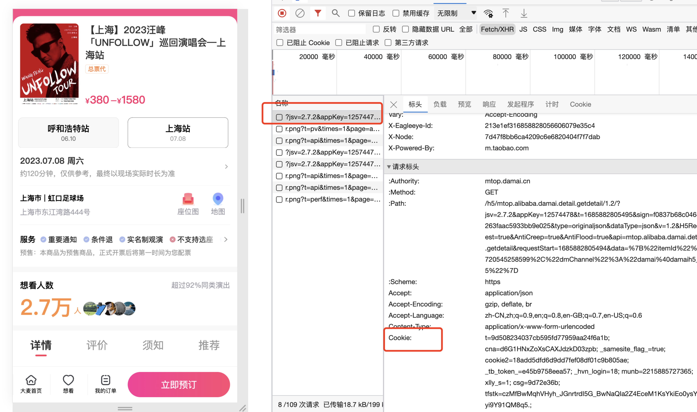

# 大麦抢票软件

一个基于 tauri 构建的抢票软件，目前只支持大麦平台（默认）。后续会支持其他平台。

## 下载

目前需要自己编译一下，后续会提供可下载的版本。自己编译需要 rust node 环境。运行 `yarn tauri build`即可，生成的程序在 src-tauri/target/release 下。

## 使用

1. 填入 cookie
   F12 打开控制台，在 network 下，找到对应的 http 请求，然后找到 cookie 选项，全部复制填入即可。
   
2. 输入 itemId

商品链接：https://m.damai.cn/damai/detail/item.html?itemId=720545258599&spm=a2o71.search.list.ditem_0 ，720545258599 即为 itemId

3. 选择对应的票档，然后点击抢票即可

## 注意事项

1. 需要再[大麦移动端](https://m.damai.cn/damai/home/index.html)（https://m.damai.cn/damai/home/index.html）进入对应的商品页面，如果支持购买，则此软件支持。
2. 目前购买票数需要跟实名观演人个数一致，后续会优化
3. 提示 session 失效等，需要更换 cookie（不一定需要重新登录，重新进入大麦页面获取即可）
4. 尽量不要多次重复尝试下订单，因为阿里系产品有风控，可能会限制账号或 ip 等。如果多次尝试导致出现账号无法登录的情况，切换个浏览器即可。

## TODO

1. 可选择观演人
2. 页面排版优化
3. 使用优化
4. 其他平台支持
5. 倒计时提醒
