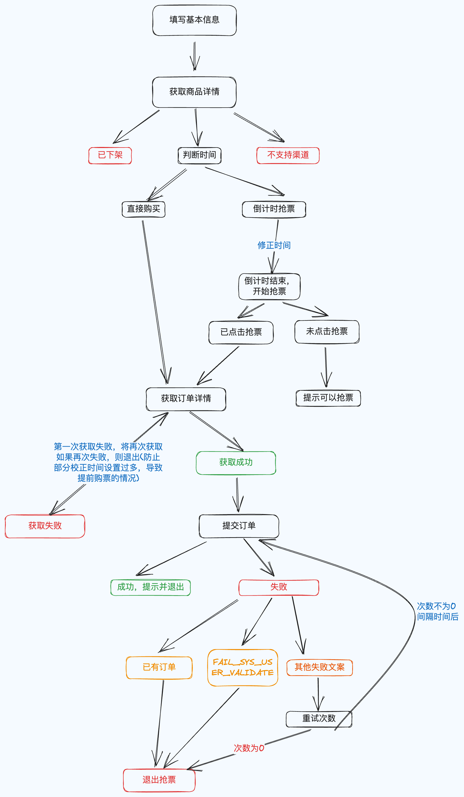

# 抢票软件（大麦）

一个基于 tauri + rust + vue 构建的抢票软件，全部调用大麦的接口。目前只支持大麦平台（默认）。

本项目只用来学习 tauri、rust 等，切勿进行盈利，所造成的后果与本人无关。

## 下载

[点击查看下载页面](https://github.com/shiyutim/tickets/releases)，下载对应的版本即可。

## 编译（需要 rust、node 环境）：

1. 安装 rust `curl --proto '=https' --tlsv1.2 -sSf https://sh.rustup.rs | sh` [rust 官网](https://www.rust-lang.org/tools/install) (输入 `rustc -V` 显示版本号，则表示安装成功)
2. 安装 node [node 官网](https://nodejs.org/en) (输入 ` node -v` 显示版本号，则表示安装成功)
3. 运行 `yarn install` 安装依赖
4. 运行 `yarn tauri dev` 启动本地项目（如果windows系统，可能需要准备 tauri 需要的[环境](https://tauri.app/zh-cn/v1/guides/getting-started/prerequisites/)），使用**编译的app**来进行调试。
4. 运行 `yarn tauri build` 打包程序。生成的程序在 src-tauri/target/release 下。

## 使用

-   填入 cookie

F12 打开控制台，在 network 下，找到对应的 http 请求，然后找到 cookie 选项，全部复制填入即可（注意要复制全）。

-   输入 itemId

商品链接：https://m.damai.cn/damai/detail/item.html?itemId=720545258599&spm=a2o71.search.list.ditem_0 ，720545258599 即为 itemId

-   选择对应的票档，然后点击抢票即可

## 注意事项

1. 目前基于 H5 平台开发的。如果 H5 平台不支持，那么本 app 也不支持
2. 提示 session 失效等，需要更换 cookie（不一定需要重新登录，重新进入大麦页面获取即可）
3. 尽量不要多次重复尝试下订单，因为阿里系产品有风控，可能会限制账号或 ip 等。如果多次尝试导致出现账号无法登录的情况，切换个浏览器即可。
4. **不支持选座**
5. FAIL_SYS_USER_VALIDATE 类似的提示可能当前已经被限制，可能需要重新登录或者切换个浏览器。

## 流程图

## TODO

1. 定时逻辑从前端移动到后端
2. 请求接口不堵塞 ui
